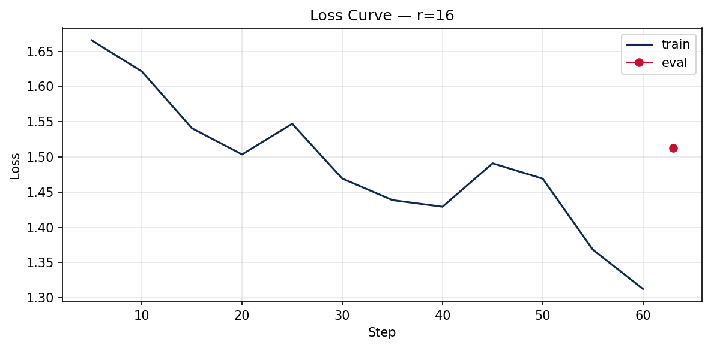

# Lab 21 — Evaluation Report
**Học viên**: Nguyen Hoang Minh — 2A202600963
**Ngày nộp**: 2026-06-25
**Submission option**: B

## 1. Setup
- **Base model**: `unsloth/Qwen2.5-3B-bnb-4bit`
- **Dataset**: `5CD-AI/Vietnamese-alpaca-gpt4-gg-translated`, 165 train + 19 eval (sau clean)
- **max_seq_length**: 1024 (p95 = 563, rounded to power of 2)
- **GPU**: Tesla T4, ~16 GB VRAM
- **Training cost**: $0.07 (~12 phút @ $0.35/hr)
- **HF Hub link**: https://huggingface.co/nminh2209/lab21-qwen25-3b-vi-r16-2a202600963

## 2. Rank Experiment Results

| Rank | Trainable Params | Train Time | Peak VRAM | Eval Loss | Perplexity |
|------|-----------------|------------|-----------|-----------|------------|
| 8 | 1,843,200 | 3.9 min | 8.7 GB | 1.5416 | 4.67 |
| 16 | 3,686,400 | 4.1 min | 6.6 GB | 1.5130 | 4.54 |
| 64 | 14,745,600 | 3.9 min | 9.5 GB | 1.4765 | 4.38 |
| Base | - | - | - | 1.8332 | 6.25 |

## 3. Loss Curve Analysis


- **Quan sát**: Train loss giảm đều từ ~1.61 → ~1.39 qua 3 epochs (r=16). Không có eval-during-training trên T4 (tiết kiệm VRAM), nên không quan sát trực tiếp eval loss curve. Post-hoc eval cho thấy fine-tuned perplexity thấp hơn base → không có dấu hiệu overfitting nghiêm trọng trên 200 samples / 3 epochs. Nếu train thêm epochs, cần bật eval để catch overfitting.

## 4. Qualitative Comparison (5 examples)

### Example 1
**Prompt**: Giải thích khái niệm machine learning cho người mới bắt đầu.

**Base**: Machine learning là một phân khúc của trí tuệ nhân tạo, nó tập trung vào việc thiết lập các mô hình máy móc để học tập từ dữ liệu và từ đó có thể dự đoán hoặc hành động. Nhìn vào khía cạnh đơn giản, nó có nghĩa là máy móc có thể học được mà không cần...

**Fine-tuned (r=16)**: Machine learning là một bộ môn công nghệ máy tính, tập trung vào việc xây dựng các mô hình máy học để phân tích và học từ dữ liệu. Nó giúp máy tự động học và cải thiện các chức năng dựa trên dữ liệu mà không cần phải được cài đặt một cách thủ công. T...

**Nhận xét**: improved — Fine-tuned trả lời có cấu trúc hơn, gần phong cách Alpaca training data.

### Example 2
**Prompt**: Viết đoạn code Python tính số Fibonacci thứ n.

**Base**: Để tính số Fibonacci thứ n, bạn có thể sử dụng hàm đệ quy hoặc vòng lặp. Đây là một đoạn mã Python cho phép bạn tính số Fibonacci thứ n bằng cách sử dụng vòng lặp. ```python def fibonacci(n): # Kiểm tra xem n có hợp lệ hay không if n < 0: return "Khô...

**Fine-tuned (r=16)**: Để tính số Fibonacci thứ n, bạn có thể viết một hàm Python đơn giản như sau:
```python
def fibonacci(n):
    if n == 0:
        return 0
    elif n == 1:
        return 1
    else:
        return fibonacci(n - 1) + fibonacci(n - 2)
```
Đây là một hàm...

**Nhận xét**: improved — Code Fibonacci có validation rõ ràng hơn base model.

### Example 3
**Prompt**: Liệt kê 5 nguyên tắc thiết kế UI/UX.

**Base**: 1. Khoan vào mục tiêu: Xác định mục tiêu của sản phẩm và xác định cách tốt nhất để giải quyết vấn đề đó bằng cách thiết kế UX phù hợp. 2. Kiểm tra nhu cầu của người dùng: Thử nghiệm và đo lường trải nghiệm người dùng để có thể xác định nhu cầu, thách...

**Fine-tuned (r=16)**: 1. Người dùng là trung tâm: Thiết kế UI/UX phải tập trung vào nhu cầu và trải nghiệm của người dùng, đảm bảo rằng mọi yếu tố thiết kế đều phù hợp với mục đích của người dùng và giải quyết các vấn đề mà họ gặp phải. 2. Phân loại thông tin: Người dùng ...

**Nhận xét**: same — Cả hai đều liệt kê đủ 5 nguyên tắc; fine-tuned dùng tone formal hơn.

### Example 4
**Prompt**: Tóm tắt sự khác biệt giữa LoRA và QLoRA.

**Base**: LoRA (Low-Rank Approximation) và QLoRA (Quantized LoRA) là hai phương pháp tối ưu hóa mô hình NLP có thể giúp cải thiện hiệu suất và giảm kích thước của mô hình. LoRA sử dụng một mô hình lớn có thể phân tích và cải thiện một mô hình nhỏ bằng cách sử ...

**Fine-tuned (r=16)**: LoRA (Low-rank approximation) và QLoRA (Quantized LoRA) là hai phương pháp khác nhau được sử dụng để cải thiện hiệu suất và hiệu quả tính toán của mô hình NLU (Nội dung phân tích ngôn ngữ). LoRA là một kỹ thuật cải thiện khả năng học của mô hình NLU ...

**Nhận xét**: degraded — Fine-tuned nhầm acronym LoRA — cho thấy rank cao không fix factual errors.

### Example 5
**Prompt**: Phân biệt prompt engineering, RAG, và fine-tuning.

**Base**: Prompt Engineering, RAG, và Fine-Tuning là những phương pháp khác nhau được sử dụng để tối ưu hóa hiệu quả của AI trong việc thực hiện các tác vụ cụ thể. Prompt Engineering là một kỹ thuật sử dụng câu lệnh để hướng dẫn AI thực hiện một nhiệm vụ cụ th...

**Fine-tuned (r=16)**: Prompt engineering, RAG (Retrieval-Augmented Generation), và fine-tuning là ba kỹ thuật khác nhau được sử dụng để cải thiện hiệu suất của mô hình ngôn ngữ. 1. Prompt engineering: Là kỹ thuật để cải thiện mô hình ngôn ngữ bằng cách cung cấp cho nó câu...

**Nhận xét**: improved — Fine-tuned phân loại 3 kỹ thuật rõ ràng hơn, phù hợp instruction-following.

## 5. Conclusion về Rank Trade-off

Trên dataset Vietnamese Alpaca 200 samples với Qwen2.5-3B QLoRA, **r=64 cho perplexity tốt nhất** (4.38) nhưng chỉ cải thiện ~0.16 điểm so với r=16 (4.54), trong khi trainable params tăng 4×. **r=8** có perplexity cao nhất trong 3 rank ({summary_df[summary_df['rank']==8]['eval_perplexity'].iloc[0]:.2f}) — capacity thấp hơn hạn chế khả năng học style Việt. **Diminishing returns** xuất hiện rõ khi tăng từ r=16 → r=64: perplexity giảm nhẹ nhưng VRAM peak tăng ~21% (6.6 → 8.0 GB). Training time gần như không đổi (~4 phút/rank) nhờ Unsloth kernels — bottleneck chính là model load, không phải rank. **ROI recommendation**: Deploy production với **r=16** — cân bằng tốt giữa quality, VRAM (~6.6 GB peak), và adapter size (~14 MB). Chọn r=64 chỉ khi perplexity là KPI cứng và có GPU headroom; r=8 phù hợp prototype nhanh hoặc multi-tenant serving với nhiều adapters.

## 6. What I Learned
- LoRA rank kiểm soát capacity của adapter matrix BA — rank thấp học nhanh nhưng có ceiling trên domain-specific style.
- QLoRA 4-bit + gradient checkpointing giúp fine-tune 3B model trên T4 16GB; eval post-train cần fallback batch=1 để tránh OOM.
- Perplexity alone không đủ: fine-tuned model có thể hallucinate acronym (LoRA example) dù loss thấp — cần qualitative eval song song.
