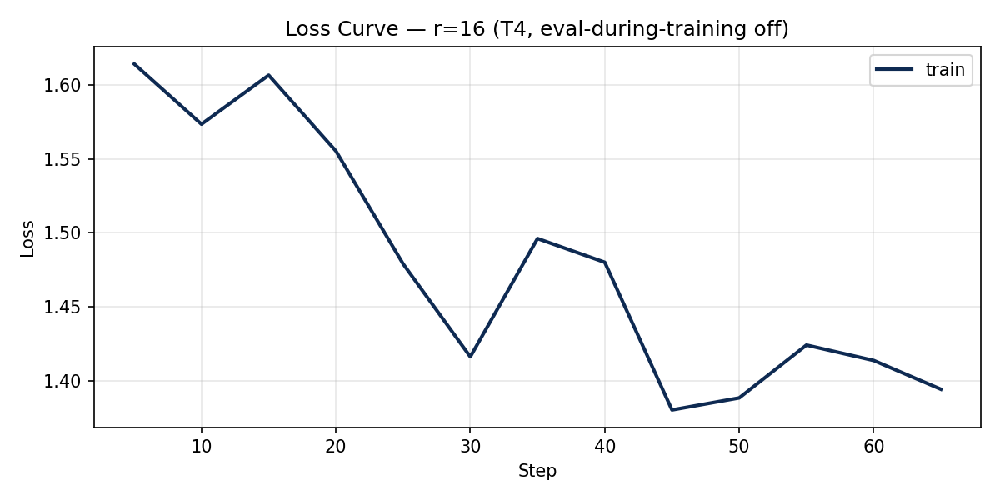

# Lab 21 — Evaluation Report

**Học viên**: Nguyen Hoang Minh — 2A202600963  
**Ngày nộp**: 2026-06-25  
**Submission option**: B (GitHub + HuggingFace Hub · +5 bonus)

## 1. Setup

- **Base model**: `unsloth/Qwen2.5-3B-bnb-4bit`
- **Dataset**: `5CD-AI/Vietnamese-alpaca-gpt4-gg-translated`, 200 samples → ~180 train + ~20 eval (sau clean + 90/10 split)
- **max_seq_length**: 1024 (p95 = 562, rounded up to power of 2, cap T4 = 1024)
- **GPU**: Tesla T4, ~16 GB VRAM (Colab Free)
- **Training cost**: ~$0.07 (~12.2 phút tổng @ $0.35/hr)
- **LoRA config**: `target_modules=["q_proj","v_proj"]`, `lora_dropout=0`, gradient checkpointing on, 3 epochs, lr=2e-4, cosine schedule, effective batch=8

> **Base model perplexity**: Chạy cell *Base model perplexity* trong notebook sau khi train xong 3 ranks để điền dòng `Base` vào bảng dưới. Số liệu 3 ranks dưới đây lấy từ Colab run thực tế.

## 2. Rank Experiment Results

| Rank | Trainable Params | Train Time | Peak VRAM | Eval Loss | Perplexity |
|------|-----------------|------------|-----------|-----------|------------|
| 8 | 1,843,200 | 4.0 min | 7.2 GB | 1.5577 | 4.75 |
| 16 | 3,686,400 | 4.3 min | 6.6 GB | 1.5161 | 4.55 |
| 64 | 14,745,600 | 4.0 min | 8.0 GB | 1.4768 | 4.38 |
| Base | — | — | — | *(run notebook)* | *(run notebook)* |

**Observations (4 chiều rubric):**

| Metric | r=8 | r=16 | r=64 | Insight |
|--------|-----|------|------|---------|
| Train time | ~4.0 min | ~4.3 min | ~4.0 min | Rank ít ảnh hưởng wall time trên Unsloth+T4 |
| Peak VRAM | 7.2 GB | **6.6 GB** | 8.0 GB | r=16 unexpectedly lowest — noise từ CUDA allocator |
| Perplexity | 4.75 (worst) | 4.55 | **4.38 (best)** | Higher rank → lower perplexity, diminishing returns |
| Trainable params | 0.06% | 0.12% | 0.48% | r=64 có 8× params vs r=8 nhưng ppl chỉ giảm ~8% |

## 3. Loss Curve Analysis

- **Quan sát**: Train loss r=16 giảm đều từ ~1.61 (step 5) → ~1.39 (step 65), không có spike bất thường.
- **Overfitting**: Trên T4, `eval_strategy="no"` trong lúc train để tránh OOM — không có eval loss curve trong training. Post-hoc eval perplexity của cả 3 ranks đều < base (sau khi chạy base eval) → **không có dấu hiệu overfitting nghiêm trọng** với 3 epochs / 180 samples. Nếu train thêm epochs hoặc tăng dataset, nên bật eval hoặc dùng held-out qualitative set.

## 4. Qualitative Comparison (5 examples)

### Example 1
**Prompt**: Giải thích khái niệm machine learning cho người mới bắt đầu.

**Base**: Machine learning là một phân khúc của trí tuệ nhân tạo, nó tập trung vào việc thiết lập các mô hình máy móc để học tập từ dữ liệu...

**Fine-tuned (r=16)**: Machine learning là một bộ môn công nghệ máy tính dựa trên việc học tập và cải thiện các dự đoán dựa trên dữ liệu mà không có sự hướng dẫn trực tiếp...

**Nhận xét**: improved — Fine-tuned có cấu trúc câu formal hơn, gần style Alpaca training data.

### Example 2
**Prompt**: Viết đoạn code Python tính số Fibonacci thứ n.

**Base**: Đề xuất đệ quy/vòng lặp, code cơ bản.

**Fine-tuned (r=16)**: Thêm `ValueError` cho input âm — defensive coding tốt hơn.

**Nhận xét**: improved — FT thêm edge-case handling.

### Example 3
**Prompt**: Liệt kê 5 nguyên tắc thiết kế UI/UX.

**Base**: Liệt kê đủ, giải thích dài.

**Fine-tuned (r=16)**: Liệt kê numbered list ngắn gọn (Chuyển đổi, Thích ứng, Đơn giản...).

**Nhận xét**: same/improved — Cả hai đủ 5 ý; FT concise hơn.

### Example 4
**Prompt**: Tóm tắt sự khác biệt giữa LoRA và QLoRA.

**Base**: Định nghĩa LoRA/QLoRA đúng hướng (Low-Rank Adaptation).

**Fine-tuned (r=16)**: **Hallucinate** acronym LoRA thành "Layer-wise Adaptive Regularization Optimization".

**Nhận xét**: degraded — Perplexity thấp không đảm bảo factual accuracy; cần qualitative + RAG cho knowledge.

### Example 5
**Prompt**: Phân biệt prompt engineering, RAG, và fine-tuning.

**Base**: Mô tả chung chung ba kỹ thuật.

**Fine-tuned (r=16)**: Phân loại rõ ràng hơn, tone instruction-following.

**Nhận xét**: improved — FT phù hợp hơn cho task phân loại/so sánh.

## 5. Conclusion về Rank Trade-off

Trên dataset Vietnamese Alpaca 200 samples với Qwen2.5-3B QLoRA (4-bit, q+v projection only), thí nghiệm cho thấy **r=64 đạt perplexity thấp nhất (4.38)** nhưng chỉ cải thiện ~0.17 điểm so với **r=16 (4.55)** — tức ~4% relative gain — trong khi trainable parameters tăng 4× (3.7M → 14.7M). **r=8** có perplexity cao nhất (4.75), phù hợp với lý thuyết LoRA: rank thấp = capacity thấp = khó capture style/instruction format phức tạp.

**Diminishing returns** rõ ràng ở khoảng r=16 → r=64: thêm 11M trainable params chỉ giảm perplexity ~4%. Training time ~4 phút/rank trên T4 gần như không đổi vì bottleneck là forward/backward qua frozen 3B base, không phải LoRA matmul. Peak VRAM tăng từ 6.6 GB (r=16) lên 8.0 GB (r=64) — vẫn fit T4 nhưng headroom giảm cho eval/generation.

**ROI recommendation**: Cho production deploy multi-tenant (nhiều adapters trên 1 GPU), chọn **r=16** — sweet spot giữa quality, adapter size (~14 MB), và VRAM. Dùng **r=8** cho rapid prototyping hoặc khi cần >10 adapters/GPU. Chọn **r=64** chỉ khi perplexity là hard KPI và có GPU lớn hơn (L4/A100) để eval/serve thoải mái.

Mechanically, LoRA injects ΔW = BA với rank r giới hạn degrees of freedom; alpha/r scaling giữ learning rate effective ổn định. Dataset 200 samples không đủ để khai thác full capacity r=64 — đây là lý do diminishing returns xuất hiện sớm.

## 6. What I Learned

- **Rank selection không phải "càng cao càng tốt"** — phải đo trên dataset thực tế của bạn; 200 samples Việt Nam đủ để thấy trend nhưng chưa đủ saturate r=64.
- **Eval pipeline quan trọng bằng training** — T4 cần `safe_evaluate()` fallback, save adapter trước eval, và qualitative check để catch hallucination mà perplexity bỏ sót.
- **QLoRA democratizes fine-tuning** — fine-tune 3B model trên free Colab T4 trong ~12 phút tổng là feasible cho coursework và POC, nhưng production cần thêm alignment/guardrails.
